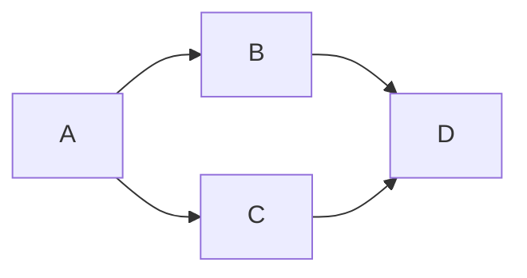

Now that we are seeing progress in supporting C++ Modules we can begin to think in ernest about how to take full advantage of Modules in our build systems. It is important to discuss how we wish to generate and consume Modules to help influence the compiler vendors as they converge on a shared solution.

## Module Interface
I will go into some detail about modules, but for a great introduction to the nitty details of how modules are constructed check out [vector-of-bool's blog](https://vector-of-bool.github.io/2019/03/10/modules-1.html) (Note: I believe the module implementation example cannot work the way outlined in the post, but otherwise find it is the best place to start).

A C++ Translation unit that contains a `module` declaration with the optional `export` keyword is known as a Module Interface Unit. When compiled, these files will produce a new Binary Module Interface file that contains the exported symbol definitions alongside the object files that contains the implementation (Note: Ignoring 'some' complexity around inlining). We can safely ignore the object files until it comes time to link everything together. However, the interface files are integral to compiling downstream dependencies and for the first time in C++ history we have to worry about the order in which we build our translation units. To add extra complexity to the problem, we are generally ignorant of the name of the Module that is being produced by a given translation unit.

## Discover or Define?
The question then becomes, do we let our builds discover the implicit ordering for all of the module inter-dependencies or do we explicitly tell the build system the entire dependency graph?

To help illustrate the different approaches imagine 4 simple modules that form a diamond dependency graph. Note: For examples we use the MSVC file extension for Binary Module Interfaces ".ifc".


```c++
import B;
import C;

int main()
{
    B::DoStuff();
    C::DoStuff();
    return 0;
}
```

```c++
export module B
import D;

export namespace B
{
    void DoStuff()
    {
        D::DoStuff();
    }
}
```

```c++
export module C
import D;

export namespace C
{
    void DoStuff()
    {
        D::DoStuff();
    }
}
```

```c++
export module D

export namespace D
{
    void DoStuff()
    {
    }
}
```

### Auto Expansion
The first approach to handling ordering within a build is to introduce a callback mechanism whereby a compiler can indicate to the build system that it must first build a Module before it can be imported. This allows for existing build systems to ignore the problem up front and continue to compile translation units in "any order". When an import declaration is seen, the compiler will attempt to resolve the module interface file using a pre-defined naming/lookup convention. If it is unable to load the interface it will indicate to the calling build system that it must pause the current build and build the requested module first. The build system would then be responsible to determine which translation unit is required to build a specific module interface file. At this point the build system must either enforce an artificial constraint that a module name must match the file name or pick a random file monitor the outputs to see if the requested interface file was produced. This process is recursively followed until a unit is encountered that can be fully resolved and compiled. Once this top level file finishes the previous units can continue compiling where they left off at the import declarations.

If we work through the above example we would tell the compiler to build A, B, C and D in any order. Lets say that we start with A.cpp. When the compiler encounters the `import B` declaration it will attempt to load B.ifc and fail. It will pause compilation and ask the build system to please compile the B Module. The build system will attempt to compile B.cpp using the naming convention that a file must be the same name as the Module inside. From here the compiler will encounter the `import D` and attempt to load D.ifc. It will fail and again ask the build system to compile the module D. The build system will now successfully compile D.cpp since it has no other module dependencies. The compiler will resume building B.cpp and succeed. The compiler will attempt to finish A.cpp and fail to load C.ifc, which will call back to the build system to ask for the C module. The build system will compile C.cpp, which will succeed in loading the D.ifc file that already exists. The compiler will make a third attempt to finish compiling and will now finish.

Auto expansion allows builds to continue to pretend that there is no order to building translation units, but this quickly falls apart. It also introduces a tight coupling between the build system and the compiler implementation for the callback protocol and the naming convention used. This makes it a limited solution with one compiler and unmanageable with many.

### Preprocessing
A group of translation units could be compiled as a "batch" where a preprocessing phase parses the module unit export and import declarations to determine the dynamic dependency graph and builds the translation units in the required order with the required references or the compiler can implement a callback design where it asks the build system to imported modules as they are discovered.

This approach is aided by the fact that module unit MUST have the module declaration at the top of the file. This allows for a streamlined parser to only interpret the import and export declarations at the top of the file to build up the full dependency graph faster than processing the entire file.

The major downside to this approach is that a build system would need to maintain the output build graph to perform incremental build or risk building an entire "batch" of translation units when a single file has changed. 

### Explicit Declare
Explicitly defining a dependency graph is straight forward and can support any combination of imports and exports with the extra cost of maintenance.

If a build system is designed with the key dependency graph already in place between project references then it is a simple matter of mapping project structures to modules.

We can also take advantage of the existing dependency graph between projects to automatically incorporate a module dependency too. This is where we can easily mirror a library boundary to have a single interface unit export the symbols that are public to the library. From here the build system can incorporate project references to automatically reference the module interface units for the upstream dependencies when building and link against the library symbols as is done today.


<script src="https://cdnjs.cloudflare.com/ajax/libs/mermaid/8.14.0/mermaid.min.js"></script>
<script>
    const config = {
        startOnLoad:true,
        theme: 'default',
        flowchart: {
            useMaxWidth:false,
            htmlLabels:true
            }
    };
    mermaid.initialize(config);
    window.mermaid.init(undefined, document.querySelectorAll('.language-mermaid'));
</script>